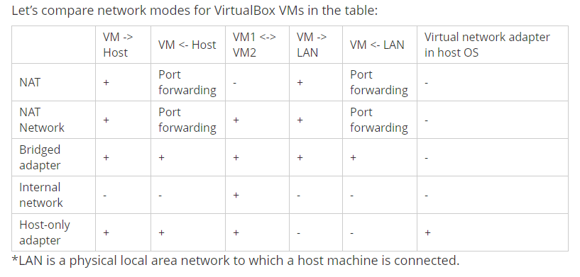
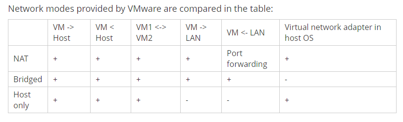

# virtualMachineSetUp 

virtualbox official tutorial[https://www.virtualbox.org/manual/ch06.html]

virtualbox vs. vmware[https://www.nakivo.com/blog/vmware-vs-virtual-box-comprehensive-comparison/#] 



VirtualBox sets two NIC  
[https://medium.com/@smiles.aayush/setup-nat-and-host-only-network-on-oracle-vm-virtualbox-9341d7babafe]  

hyper-v 
[https://docs.microsoft.com/en-us/virtualization/hyper-v-on-windows/user-guide/setup-nat-network] 

```


show ip, NIC
ip add
ifconfig

restart network
sudo systemctl restart networking
service network restart

sudo vim /etc/network/interfaces
Make the following entry in the end and save the file.
auto enp0s8
iface enp0s8 inet static
192.168.56.101

switch on the interface
sudo ifup enp0s8 up
sudo reboot


Routing and Remote Access - Windows 10 Service
doesn't find any tutorials
```
VirtualBox port forwarding   
https://dbabasis.wordpress.com/2017/09/16/port-forward-to-nat-networks-from-different-hosts-on-virtualbox/ (nat port forwarding)  
https://www.golinuxcloud.com/configure-nat-port-forwarding-virtualbox-cli/ (bridge port forwarding?)  
https://www.techrepublic.com/article/how-to-use-port-forwarding-in-virtualbox/  

VirtualBox Host Network Manager(create host-only network) 
https://www.techrepublic.com/article/how-to-create-virtualbox-networks-with-the-host-network-manager/   

how bridge works[https://www.jianshu.com/p/c62bb377b016]  
在桥接模式下，例如在 windows 下使用 vmware 时，明显看到会生成多个虚拟网卡出来，但却没有一个网卡是属于桥接的，原因是虚拟机采用桥接方式时，是不需要虚拟网卡的，这时候虚拟机操作系统和实体机操作系统同时使用真实网卡工作，然后真是网卡发送数据出去，而如果虚拟机发送数据给真实机，则数据流向是：虚拟机系统->真实网卡->路由器->真实网卡->实体机系统，不难看出同一个数据经过网卡在路由器上面绕了一圈又回到了网卡。 

hwo nat works 
NAT模式实际是虚拟了一个网卡出来，虚拟机直接使用链接这个虚拟网卡，每次访问和交互通过这个虚拟网卡交换数据。虚拟机发送数据给实体机：虚拟机系统->虚拟网卡->实体机系统（可以发现是不经过真实网卡的流程简单很多）；虚拟机访问外网：虚拟机系统->虚拟网卡->实体机系统->真实网卡->路由器->外网* 。*   

虚拟机 nat 原理[https://bbs.csdn.net/topics/390760405]  
1 vm8 带nat的功能 
   nat不是转化ip地址  而是靠修改传送的数据包 来 实现的
 
  这里先知道一下 3个网卡 
   虚拟机的网卡    （虚拟机里的网卡）    虚拟
  nat的网卡  （ 实体机里 网络里的 适配器 里的 VMnet1 ） 虚拟
  物理网卡  （实体机的物理网卡） 物理
   
 nat的连接方式是  物理网卡 ——》vm nat程序 ——》nat的网卡（inside）——》虚拟机网卡
 
  在知道一下数据包 
   一个网络数据  包含了 发送者的ip 发送者的端口  接收者的ip 接受者的端口
------------------------------------------------------------------------------------------------------------------------   
假设
       nat outside 为 172.16.5.4 inside为 192.168.1.1

  1.  从虚拟机网卡发出数据包
          接受者  172.16.5.1端口 80   发送者 192.168.1.2 端口 5421 

2.         网关收到数据包后  交给nat
          nat 修改发送者 ip为   outside的ip     发送者端口  修改为 ouside空闲的端口
           数据包变为 接受者  172.16.5.1端口 80   发送者  172.16.5.4 端口65
            nat 上建立一个表 
                     172.16.5.4 :65-------192.168.1.2:5421
             然后把数据 从172.16.5.4 (outside端) 发送. 出去

3.      接受返回的数据包 
         对方返回的数据包  （依据收到的数据包 得到 接收者的ip 端口 ）
          发送者 是 172.16.5.1 端口80  接受者 172.16.5.4 端口65                     
            
4.   nat outside 收到数据包后
      首先查 表
     看看有没有匹配的 没有就丢弃
     查表一看 匹配这一条
    172.16.5.4 :65-------192.168.1.2:5421
    nat 修改数据包的接收方的ip 和端口
     修改为
     发送者 是 172.16.5.1 端口80  接受者 192.168.1.2端口5421
    再从192.168.1.1（ inside端 ）发给192.168.1.2 
  
这样实现了 跨网段的 nat过程
整理一下 数据包的变化过程
     发出
       inside （ 进）
     接受者  172.16.5.1端口 80   发送者 192.168.1.2 端口 5421 
       nat后 
      接受者  172.16.5.1端口 80   发送者  172.16.5.4 端口65
       outside （出）
  
      收数据包
        outside （进） 
      发送者 是 172.16.5.1 端口80  接受者 172.16.5.4 端口65    
      nat 后
        发送者 是 172.16.5.1 端口80  接受者 192.168.1.2端口5421 
      inside （出）
 --------------------------------------------------------------------------------------------------------------------- 
2 .3 问题  都对
4的问题

虚拟机——》外网
虚拟机网卡 ——》nat的网卡（inside） ——》vm nat——》物理网卡

外网——》虚拟机
物理网卡 ——》vm nat——》nat的网卡（inside）——》虚拟机网卡

